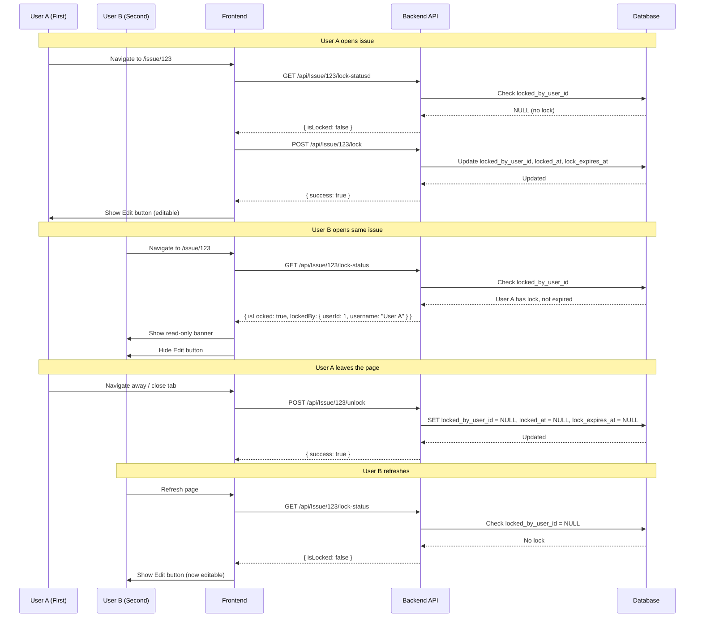

# Issue Locking System Architecture (Simplified)

## Overview
This document describes the implementation of an exclusive editing system for issues using fields added to the existing Issues table. The first user to open an issue gets edit access, while others get read-only access.

## Database Schema Changes

### Add Columns to Issues Table
```sql
ALTER TABLE Issues ADD COLUMN locked_by_user_id INT NULL;
ALTER TABLE Issues ADD COLUMN locked_at DATETIME NULL;
ALTER TABLE Issues ADD COLUMN lock_expires_at DATETIME NULL;
```

## System Flow



## API Endpoints (Backend)

### 1. Get Lock Status
```
GET /api/Issue/{id}/lock-status
Response:
{
  "isLocked": true,
  "lockedBy": {
    "userId": 1,
    "username": "john.doe"
  },
  "lockedAt": "2026-02-12T06:30:00Z"
}
```

### 2. Lock Issue (Acquire Edit Access)
```
POST /api/Issue/{id}/lock
Request Body:
{
  "userId": 1,
  "username": "john.doe"
}
Response:
{
  "success": true
}
Logic:
- Check if issue exists
- If locked_by_user_id is NULL or expired, acquire lock
- If locked_by_user_id matches current user, refresh lock
- If locked by another user, return error
- Set locked_by_user_id, locked_at, lock_expires_at (now + 10 minutes)
```

### 3. Unlock Issue (Release Edit Access)
```
POST /api/Issue/{id}/unlock
Request Body:
{
  "userId": 1
}
Response:
{
  "success": true
}
Logic:
- Check if issue is locked by the requesting user
- If yes, set locked_by_user_id = NULL, locked_at = NULL, lock_expires_at = NULL
- Return success
```

### 4. Heartbeat (Keep Lock Alive)
```
POST /api/Issue/{id}/heartbeat
Request Body:
{
  "userId": 1
}
Response:
{
  "success": true
}
Logic:
- Check if issue is locked by the requesting user
- If yes, refresh lock_expires_at (now + 10 minutes)
```

## Frontend API Methods (useApi.ts)

```typescript
// Lock methods
async lockIssue(id: number) {
  return await $fetch(`${this.baseApiUrl}/api/Issue/${id}/lock`, {
    method: "POST",
    credentials: "include",
  });
}

async unlockIssue(id: number) {
  return await $fetch(`${this.baseApiUrl}/api/Issue/${id}/unlock`, {
    method: "POST",
    credentials: "include",
  });
}

async getIssueLockStatus(id: number) {
  return await $fetch(`${this.baseApiUrl}/api/Issue/${id}/lock-status`, {
    method: "GET",
    credentials: "include",
  });
}

async heartbeatIssue(id: number) {
  return await $fetch(`${this.baseApiUrl}/api/Issue/${id}/heartbeat`, {
    method: "POST",
    credentials: "include",
  });
}
```

## Frontend Composables

### useIssueLock.ts
```typescript
export function useIssueLock(issueId: Ref<number>) {
    const api = useApi();
    const { userProfile } = useAuthStorage();
    
    const lockStatus = ref<{
        isLocked: boolean;
        lockedBy: { userId: number; username: string } | null;
        lockedAt: string | null;
    }>({
        isLocked: false,
        lockedBy: null,
        lockedAt: null
    });
    
    const isEditable = computed(() => {
        if (!lockStatus.value.isLocked) return true;
        if (lockStatus.value.lockedBy?.userId === userProfile.value?.UserId) return true;
        return false;
    });

    const checkLockStatus = async () => {
        try {
            const res: any = await api.getIssueLockStatus(issueId.value);
            lockStatus.value = res;
        } catch (err) {
            console.error("Failed to get lock status", err);
            lockStatus.value = { isLocked: false, lockedBy: null, lockedAt: null };
        }
    };

    const acquireLock = async () => {
        try {
            await api.lockIssue(issueId.value);
            await checkLockStatus();
        } catch (err: any) {
            // Lock failed, fetch current status
            if (err?.data?.isLocked) {
                lockStatus.value = err.data;
            } else {
                await checkLockStatus();
            }
        }
    };

    const releaseLock = async () => {
        try {
            await api.unlockIssue(issueId.value);
        } catch (err) {
            console.error("Failed to release lock", err);
        }
    };

    const startHeartbeat = () => {
        setInterval(async () => {
            if (lockStatus.value.isLocked && 
                lockStatus.value.lockedBy?.userId === userProfile.value?.UserId) {
                try {
                    await api.heartbeatIssue(issueId.value);
                } catch (err) {
                    console.error("Heartbeat failed", err);
                }
            }
        }, 30000); // Every 30 seconds
    };

    return {
        lockStatus,
        isEditable,
        checkLockStatus,
        acquireLock,
        releaseLock,
        startHeartbeat
    };
}
```

## Page Implementation

### app/pages/issue/[id]/index.vue

```vue
<script setup lang="ts">
// ... existing imports

const { lockStatus, isEditable, acquireLock, releaseLock, startHeartbeat } = useIssueLock(id);

// On mount, check status and acquire lock if available
onMounted(async () => {
    await checkLockStatus();
    
    // Only try to acquire lock if not already locked by someone else
    if (!lockStatus.value.isLocked) {
        await acquireLock();
    }
    
    startHeartbeat();
});

// On unmount, release lock
onUnmounted(() => {
    releaseLock();
});

// Handle page navigation
const router = useRouter();
router.beforeEach(() => {
    releaseLock();
});
</script>

<template>
    <div>
        <!-- Read-only banner -->
        <UAlert
            v-if="!isEditable && lockStatus.isLocked"
            icon="i-lucide-lock"
            title="Read-Only Mode"
            :description="`This issue is being edited by ${lockStatus.lockedBy?.username}`"
            color="warning"
            variant="subtle"
            class="mb-4"
        />

        <!-- Edit button - hidden when read-only -->
        <div class="mb-6 flex items-center justify-between">
            <UButton
                @click="router.push('/issue')"
                variant="outline"
                icon="i-lucide-arrow-left"
            >
                Back
            </UButton>
            
            <UButton
                v-if="editIssueLink && isEditable"
                :to="editIssueLink"
                color="primary"
                icon="i-lucide-edit-2"
            >
                Edit Issue
            </UButton>
        </div>
    </div>
</template>
```

## Lock Expiration Logic

The backend should implement lock expiration:
- `lock_expires_at` = `locked_at` + 10 minutes
- When checking lock status, if `lock_expires_at` < `NOW()`, treat as not locked
- Periodically cleanup expired locks (optional, can rely on next access to clear)

## Lock Release Scenarios

| Scenario | Action |
|----------|--------|
| User navigates to another page | Release lock via `router.beforeEach` |
| User closes browser tab | Release lock via `beforeunload` event |
| User switches to another tab | Lock maintained (heartbeat continues) |
| User is inactive for long time | Lock expires after 10 minutes |
| Browser crashes | Lock expires after 10 minutes |

## Error Handling

| Error | Handling |
|-------|----------|
| Lock acquisition fails | Fetch lock status, show banner with lock info |
| Heartbeat fails | Retry once, then release lock |
| Network disconnects | Lock expires naturally after 10 minutes |
