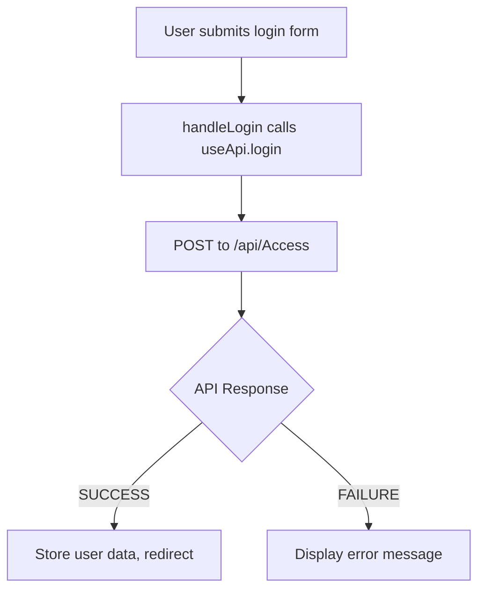

# Plan to Connect Login UI to API and Create useApi Composable

## Overview
This plan outlines the steps to integrate the login form in `pages/index.vue` with the authentication API in `../ITSAPI/ITSAPI/Controllers/AccessController.cs`, and create a reusable `useApi` composable for bundling API calls.

## API Details
- **Endpoint**: POST `http://localhost:7298/api/Access` (based on NUXT_PUBLIC_LIVE_API from .env)
- **Request Body**: `{ email: string, password: string }`
- **Response**: 
  - Success: `{ status: "SUCCESS", objParam1: userProfile, stringParam1: encryptedCredentials, stringParam2: md5Hash, ... }`
  - Failure: `{ status: "FAILURE", message: errorMessage }`

## Steps
1. **Examine API Structure**: Review AccessController.cs to confirm request/response formats and any authentication requirements.
2. **Create Composables Directory**: Ensure `composables/` directory exists in the project root.
3. **Create useApi.ts Composable**:
   - Define a `login` function that uses `$fetch` to POST to the API endpoint.
   - Handle response parsing and error throwing.
   - Structure for extensibility to add more API calls.
4. **Update index.vue**:
   - Import the `useApi` composable.
   - Modify `handleLogin` to call the login function asynchronously.
   - Add loading state and error display.
5. **Implement Error Handling**: Show user-friendly error messages for API failures.
6. **Implement Success Handling**: On successful login, store user data (e.g., in localStorage or Pinia store) and redirect to dashboard.
7. **Test Integration**: Verify the login works end-to-end, including edge cases.

## Workflow Diagram

## Notes
- The API uses custom encryption for credentials; ensure proper handling.
- Consider adding JWT token management if the API supports it.
- The composable should be designed to easily add more API endpoints.